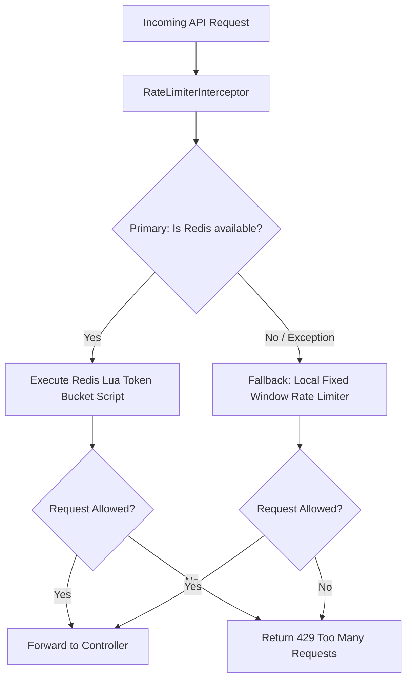

# Distributed Rate Limiter with Local In-Memory Fallback

A high-performance, robust, and fault-tolerant Rate Limiter built with Spring Boot and Redis. This rate limiter is designed for distributed microservices environments, utilizing Redis for centralized rate limit coordination. In case of Redis server outages or network partition events, it gracefully falls back to a local, thread-safe, in-memory Fixed Window rate limiter to ensure continuous service availability.

---

## Key Features

- **Primary Rate Limiting (Distributed)**: Uses **Redis** with an atomic Lua script to implement a **Token Bucket** algorithm, ensuring accurate, cluster-wide rate limiting with low overhead.
- **Fallback Rate Limiting (Local)**: Automatically falls back to a local **Fixed Window** rate limiter managed in-memory (`ConcurrentHashMap` and `AtomicInteger`) if the Redis service becomes unavailable.
- **Spring Interceptor Integration**: Applied globally to designated endpoints (`/api/**`) using a Spring `HandlerInterceptor`, protecting your APIs before reaching controller logic.
- **Client IP-Based Identification**: Automatically identifies clients using the `X-Forwarded-For` HTTP header (supporting reverse proxies/load balancers) or fallback remote address.
- **Highly Configurable**: Limits, window sizes, and Redis connection pools are easily adjustable in the configuration.

---

## Architecture



---

## Configuration

Rate limiter settings are defined in the `src/main/resources/application.properties` file:

```properties
# Application Name
spring.application.name=rate_limiter

# Redis Connection Settings
spring.data.redis.host=localhost
spring.data.redis.port=6379

# Redis Client Connection Pool (Low Latency)
spring.redis.jedis.pool.max-active=100
spring.redis.jedis.pool.max-idle=16
spring.redis.jedis.pool.min-idle=8
spring.redis.jedis.pool.max-wait=100ms

# Fallback Rate Limiter Settings
ratelimiter.fixedWindow.limit=10
ratelimiter.fixedWindow.window=60000
```

---

## Getting Started

### Prerequisites

- Java 17 or higher
- Maven 3.6+
- Redis (Optional for local testing, as the service gracefully falls back if Redis is missing)

### Installation & Run

1. Clone the repository and navigate to the project directory:
   ```bash
   cd /home/parth/javaProject/Rate_Limiter/rate_limiter
   ```

2. Build the project using Maven:
   ```bash
   mvn clean package
   ```

3. Run the Spring Boot application:
   ```bash
   mvn spring-boot:run
   ```

---

## Testing the Application

### 1. Verification of Rate Limiting
To test the rate limiter, send multiple HTTP GET requests to `/api/ping`:

```bash
curl -i http://localhost:8080/api/ping
```

- **Under Limit**: Returns `200 OK` with body `pong`.
- **Exceeding Limit**: Returns `429 Too Many Requests` with body `Too many requests`.

### 2. Verification of Fallback Logic
You can verify the Redis fallback mechanism by shutting down your local Redis instance:

```bash
# Stop your Redis service
sudo service redis-server stop
```

Upon stopping Redis, you will see logs indicating that the application is falling back to the local Fixed Window algorithm:
```
[ERROR] Redis is down or returned an error. Falling back to local Fixed Window rate limiter. Error: ...
```

---

## Running Unit Tests

The project includes test cases validating the fallback logic under Mockito-simulated Redis connection failures. To run the tests, execute:

```bash
mvn test
```

Test coverage focuses on:
- Ensuring the primary Redis token bucket is used when Redis is healthy.
- Ensuring the application falls back to `RateLimiterFixedWindow` immediately when a `RedisConnectionFailureException` occurs.
